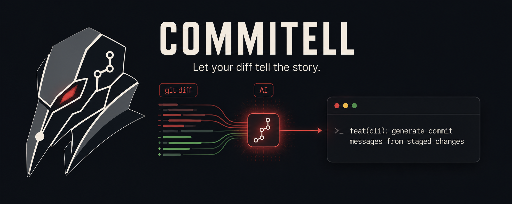

# commitell

`commitell` turns every dirty change in the current Git repository into one
AI-written, DCO-signed commit.

```sh
export OPENROUTER_API_KEY=sk-or-v1-...
commitell
```

It includes tracked, staged, unstaged, deleted, and untracked files. There is
no prompt and no automatic push.

## Privacy

Every OpenRouter request requires both Zero Data Retention and denied data
collection. The fixed model order is:

1. `google/gemini-3.1-flash-lite`
2. `qwen/qwen3-coder-30b-a3b-instruct`

If neither model is available under those policies, `commitell` stops before
staging anything. It also rejects common secret filenames and token patterns
locally, omits binary contents, and sends only a bounded diff plus recent
commit subjects.

The local scanner is deliberately conservative, but it is not a complete
secret-management system. OpenRouter still processes the request and retains
request metadata under its published policy even when prompt retention is
disabled.

## Install

Requires Go 1.26+ and Git:

```sh
go install github.com/timfewi/commitell@latest
```

Or build the current checkout:

```sh
go build .
```

## Behavior

Before changing the index, `commitell`:

- rejects merge conflicts and in-progress Git operations;
- checks `user.name` and `user.email`;
- scans the outbound text for likely secrets;
- generates and validates a subject with an optional body;
- verifies that the working tree did not change during analysis.

It then runs the equivalent of:

```sh
git add -A
git commit -s -m "<subject>" -m "<optional body>"
```

Normal Git hooks remain active. If a hook or Git itself rejects the commit,
the changes remain staged and no file content is discarded.

## Development

```sh
go test ./...
go vet ./...
```

Contributions are welcome. See [CONTRIBUTING.md](CONTRIBUTING.md) for the
small set of project rules.

## License

MIT
