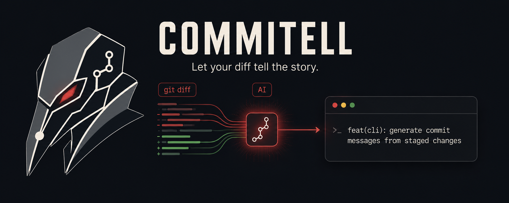

# commitell

[](https://github.com/timfewi/commitell/actions/workflows/ci.yml)
[](LICENSE)

`commitell` turns Git changes into one or more DCO-signed commits with
model-written or deterministic local messages. With no options it preserves
the original workflow and commits the complete dirty working tree.

```sh
export OPENROUTER_API_KEY=sk-or-v1-...
commitell
```

For a provider-free commit message with no model API request or API key:

```sh
commitell --offline
```

Select, split, and publish changes when needed:

```sh
commitell --staged --exclude "broken.txt,generated.json"
commitell --split --model google/gemini-3.1-flash-lite --dry-run
commitell --auto-model --dry-run
commitell --split --push --pr --base main
commitell --push --force --base main
```

List models that are compatible with your OpenRouter account, its privacy
settings and guardrails, commitell's required parameters, and an available
Zero Data Retention endpoint:

```sh
commitell --models
commitell --models --eu
```

`--models --eu` and commit runs with `--eu` use OpenRouter's EU in-region
routing when it is enabled for the account. This is a routing property, not a
legal GDPR certification.

## Options

- `--staged` commits only the content already in the Git index.
- `--exclude FILES` excludes exact repository-relative paths. Repeat the flag
  or pass comma-separated paths. Globs and filenames containing commas are not
  supported.
- `--split` asks the model to group whole files into at most eight logical
  commits. A file and both sides of a rename remain in one commit.
- `--model MODEL` is repeatable and defines the complete model fallback order.
  `--solver` remains an alias.
- `--auto-model` discovers the models available to the API key and selects
  compatible ZDR models with at least 128k context. It keeps commitell's
  preferred models first, then ranks fallbacks by context window and price.
- `--offline` generates a conservative Conventional Commit message locally
  without contacting OpenRouter or any model API. It needs no API key and
  cannot be combined with model selection, `--eu`, or model-driven `--split`.
- `--dry-run` generates and prints the plan without changing Git or publishing.
- `--eu` routes model discovery and completions through `eu.openrouter.ai`.
- `--push` pushes the current branch after all commits succeed.
- `--force` bypasses local likely-secret checks and uses `git push
  --force-with-lease`. It is required to push the default branch. This can
  send content that looks like a secret to the model, so use it only after
  reviewing the diff.
- `--pr` implies `--push` and creates a draft pull request with GitHub CLI.
- `--remote NAME` selects the publishing remote; the default is `origin`.
- `--base BRANCH` declares the protected default and pull-request base branch.

Every option has a short form shown by `commitell --help`. Boolean short
options can be clustered, so `commitell -scd` is equivalent to
`commitell --staged --split --dry-run`. Value-taking options such as `-m`
must be separate or last in a cluster.

If a changed file cannot safely be read, commitell stops and names the file.
When the local scanner finds a possible secret, commitell shows only its
location and detection type, then asks before any model request or staging:

```text
Continue anyway? [y/N]
```

Answer `y` to proceed. Answer `n` or press Enter to cancel without staging or
sending the content. Non-interactive runs fail closed; review the finding and
use `--exclude` or the explicit `--force` override. Matched secret values are
not printed, and files are never excluded automatically. This warning flow also
covers harmless fixtures such as test values in `flake.nix`.

## Privacy

For the strongest privacy guarantee, use `commitell --offline`. It creates the
message from local file status only, makes no OpenRouter or model API request,
and does not require `OPENROUTER_API_KEY`. The result is intentionally more
conservative than a model-written message. Explicit `--push` or `--pr` still
sends commits to the configured Git remote; offline mode only guarantees that
no model provider receives the diff.

Every OpenRouter completion request requires both Zero Data Retention and
denied data collection. The default model order is:

1. `google/gemini-3.1-flash-lite`
2. `google/gemini-2.5-flash-lite`
3. `openai/gpt-4o-mini`

These model IDs are availability, context, quality, and cost preferences, not
the privacy trust boundary. OpenRouter may select or fall back between provider
endpoints only when they satisfy the request's ZDR, denied-data-collection, and
required-parameter constraints. If none qualify, the request fails rather than
relaxing a privacy constraint. `--force` never changes ZDR or provider privacy;
it only bypasses local likely-secret checks and controls protected-branch
publishing.

Repeated `--model` (or legacy `--solver`) flags replace this order. Use
`--auto-model` to discover and rank compatible account models automatically.
If all three fast defaults are unavailable under the required policies,
`commitell` stops before staging anything; `commitell --offline` remains the
provider-independent fallback. The local scanner flags common secret filenames
and token patterns for confirmation, binary contents are omitted, and only a
bounded diff plus recent commit subjects is sent. `--force` is the explicit
override for the local likely-secret confirmation.

`--models` obtains the account-filtered list from OpenRouter and intersects it
with current ZDR endpoints. OpenRouter applies the API key's account privacy
settings and guardrails to that list; commitell does not request privileged
guardrail details or require a management key.

The local scanner is deliberately conservative, but it is not a complete
secret-management system. OpenRouter still processes the request and retains
request metadata under its published policy even when prompt retention is
disabled. Committell cannot inspect or override OpenRouter's account-level
Private Input & Output Logging or OpenRouter Use of Inputs/Outputs opt-ins; keep
both disabled for private cloud use.

## Install

Requires Go 1.26+ and Git:

```sh
go install github.com/timfewi/commitell@latest
```

Published releases are tagged with semantic versions. Check an installation
without making an API request:

```sh
commitell --version
```

Or build the current checkout:

```sh
go build .
```

### Nix

Run it without installing anything:

```sh
nix run github:timfewi/commitell
```

Append a published tag such as `/v0.2.0` for a reproducible version. The flake
declares `packages.default` and `devShells.default` for `x86_64-linux`,
`aarch64-linux`, and `aarch64-darwin`. To install it from a NixOS or
home-manager config, add the input and reference the package in a module that
receives `inputs`:

```nix
# flake.nix
inputs.commitell = {
  url = "github:timfewi/commitell";
  inputs.nixpkgs.follows = "nixpkgs";
};

# any module with `inputs` in scope
environment.systemPackages = [
  inputs.commitell.packages.${pkgs.stdenv.hostPlatform.system}.default
];
```

Except in `--offline` mode, `commitell` reads `OPENROUTER_API_KEY` from the
environment. Do not put the key in a Nix expression — string literals end up
world-readable in `/nix/store`.
Wrap the package instead and read the secret at runtime, for example from
[agenix](https://github.com/ryantm/agenix):

```nix
pkgs.writeShellApplication {
  name = "commitell";
  runtimeInputs = [ pkgs.git pkgs.coreutils ];
  text = ''
    OPENROUTER_API_KEY="$(cat ${config.age.secrets.openrouter-api-key.path})" \
      exec ${inputs.commitell.packages.${pkgs.stdenv.hostPlatform.system}.default}/bin/commitell "$@"
  '';
}
```

## Behavior

Before changing the index, `commitell`:

- rejects merge conflicts and in-progress Git operations;
- checks `user.name` and `user.email`;
- scans the outbound text for likely secrets and asks before proceeding;
- generates and validates a subject with an optional body;
- verifies that the working tree did not change during analysis.

With no selection options it then runs the equivalent of:

```sh
git add -A
git commit -s -m "<subject>" -m "<optional body>"
```

Normal Git hooks remain active. Selective and split commits use a temporary Git
index so excluded or unrelated staged changes remain untouched. If a later
split commit fails, earlier split commits remain in history and commitell
reports how many groups completed; it never discards the remaining working-tree
or index content.

Publishing is deliberately explicit. It refuses detached HEAD and refuses the
declared or detected default branch unless `--force` is supplied. With that
flag it uses Git's safer `--force-with-lease` mode; it never creates a branch.
PR preflight checks `gh auth status`; commitell then pushes itself and invokes
`gh pr create --draft --fill` with explicit base and head branches.

## Development

Make remains the authoritative build and CI interface:

```sh
make check
nix develop path:. --command make nix-check
```

The Justfile provides short, discoverable wrappers for local development:

```sh
just --list
just check
just help
```

With Nix, `nix develop` provides Go, gopls, Git, GitHub CLI, Make, Just, nixfmt,
deadnix, and statix; `nix build` runs the tests as part of the build and wraps
the installed program with its `git` and `gh` runtime dependencies.
`direnv allow` activates the same environment automatically through `.envrc`.
Editors supporting Dev Containers can open `.devcontainer/devcontainer.json`
for an equivalent Go 1.26 environment.

Contributions are welcome. See [CONTRIBUTING.md](CONTRIBUTING.md) for the
project rules. Maintainers can use [RELEASE.md](RELEASE.md) for the release and
Nixpkgs submission checklist.

## License

MIT
